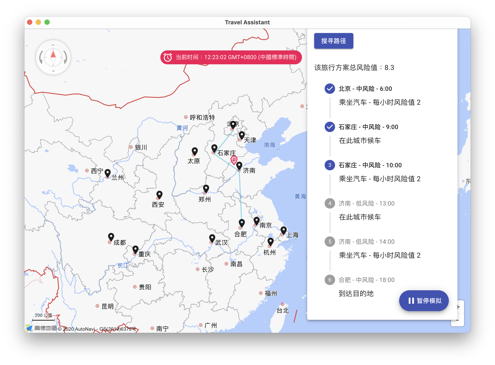

# 任务概述

## 设计任务的描述

城市之间有各种交通工具（汽车、火车和飞机）相连，有些城市之间无法直达，需要途径中转城市。某旅客于某一时刻向系统提出旅行要求。考虑在当前 COVID-19 疫情环境下，各个城市的风险程度不一样，分为低风险、中风险和高风险三种。系统根据风险评估，为该旅客设计一条符合旅行策略的旅行线路并输出；系统能查询当前时刻旅客所处的地点和状态（停留城市/所在交通工具），具体旅行策略如下：

- **最少风险策略**：无时间限制，风险最少即可；

- **限时最少风险策略**：在规定的时间内风险最少。

## 功能需求说明与分析

基本功能需求如下：

- 城市总数不少于 10 个，为不同城市设置不同的单位时间风险值：低风险城市为 0.2；中风险城市为 0.5；高风险城市为 0.9。各种不同的风险城市分布要比较均匀，个数均不得小于 3 个。旅客在某城市停留风险计算公式为：旅客在某城市停留的风险 = 该城市单位时间风险值 $\times$ 停留时间。
- 建立汽车、火车和飞机的时刻表（航班表），假设各种交通工具均为起点到终点的直达，中途无经停。
   - 不能太简单，城市之间不能总只是 1 班车次；
   - 整个系统中航班数不得超过 10 个，火车不得超过 30 列次；汽车班次无限制；
- 旅客的要求包括：起点、终点和选择的低风险旅行策略。其中，低风险旅行策略包括：
   - **最少风险策略**：无时间限制，风险最少即可；
   - **限时最少风险策略**：在规定的时间内风险最少；
- 旅行模拟系统以时间为轴向前推移，每 10 秒左右向前推进 1 个小时(非查询状态的请求不计时，即：有鼠标和键盘输入时系统不计时)；
- 不考虑城市内换乘交通工具所需时间；
- 系统时间精确到小时；
- 建立日志文件，对旅客状态变化和键入等信息进行记录。

另外，本次课程设计还实现了如下选做功能：

- 用图形绘制地图，并在地图上实时反映出旅客的旅行过程；
- 为不同交通工具设置不同单位时间风险值，交通工具单位时间风险值分别为：汽车 = 2；火车 = 5；飞机 = 9。旅客乘坐某班次交通工具的风险 = 该交通工具单位时间风险值 $\times$ 该班次起点城市的单位风险值 $\times$ 乘坐时间。将乘坐交通工具的风险考虑进来，实现前述最少风险策略和限时风险最少策略。

# 总体方案设计说明

## 编程语言与开发环境

该程序主体部分采用 Typescript 语言进行开发，图形部分采用 Electron + React 框架以实现优美的界面和跨平台的功能。

开发过程中，使用 ESLint 对项目代码格式进行规范，并采用 TSDoc 对代码注释进行文档化管理。

开发环境为 macOS 10.16 系统，并成功在 Windows 下进行运行与测试。

## 总体结构和模块划分

本程序主体部分主要分为算法、日志、图形界面三个模块。具体目录结构如下：

- `app/algorithm`：包含核心算法相关代码；
- `app/components`：包含图形界面相关代码；
- `app/logging.ts`：日志记录模块；
- `app/data`：包含城市以及交通工具的数据。

其中，`app/main.dev.ts` 为主程序的入口点，Electron 环境的初始化在此处进行。`app/algorithm` 文件夹下包含了核心数据结构及规划算法，这里实现了 Dijkstra 算法。

图形界面的主体代码均在 `app/components` 文件夹下，并以 `app/App.tsx` 为图形界面的入口点。

本程序充分利用了 Electron 的特性，通过 WebWorker 功能实现了图形界面与规划算法的**前后端分离**。规划模块通过 `app/algorithm/planner.worker.ts` 入口点注册为一个单独的 Worker，并与图形界面使用**消息传递**的机制进行通信。这样，进行路径规划不会阻塞程序主界面，同时使得整体模块划分逻辑清晰。

# 数据结构说明和数据字典

在算法部分，我们使用了如下数据结构：


各数据结构功能如下：

- `City`：代表一座城市；
- `Route`：代表一条航线/车次；
- `Graph`：以邻接矩阵存储的图信息；
- `Edge`：代表图中的一条边。

各数据结构声明如下：

```javascript
/**
 * 代表一座城市。
 *
 * @property name 城市名称
 * @property position 城市经纬度
 * @property risk 城市风险等级
 */
export interface City {
  name: string;
  position: { longitude: number; latitude: number };
  risk: string;
}


/**
 * 代表一条航线/车次。
 *
 * @property from 始发城市
 * @property to 到达城市
 * @property startTime 发车时间
 * @property endTime 到达时间
 * @property type 交通工具类型（飞机/火车/汽车）
 */
export interface Route {
  from: string;
  to: string;
  startTime: number;
  endTime: number;
  type: string;
}

/**
 * 代表图中的一条边。
 * @property time 边的长度/时间
 * @property type 边的类型（交通工具）
 */
export interface Edge {
  time: number;
  type: string;
}

/**
 * 图中的坐标以 [城市, 时间] 的二元组来定位。
 */
export type CityTimeNode = [string, number];

/**
 * 根据旅行时刻表来构建出的图，以邻接矩阵方式存储。
 */
export class Graph {
  /**
   * 以邻接矩阵存储的图信息。
   */
  matrix: Dictionary<[CityTimeNode, CityTimeNode], Edge>;

  /**
   * 构造图。
   * @param cities 城市列表，用来创建结点
   */
  constructor(private cities: City[]) {
    this.matrix = new Dictionary();
  }
}
```


# 各模块设计说明

## 规划算法实现

我们所要解决的问题可以被抽象为**最短路径问题**。这个问题旨在寻找图（由结点和路径组成的）中两结点之间的最短路径。

对于本系统的用例，用户输入起点与终点城市进行规划，从而该问题简化为**单源最短路径问题**。单源最短路径最常见的解法为 **Dijkstra 算法**，其复杂度为 $O(|V|^2)$。这也是我们所实现的算法。

要求实现的规划策略有两种：

- **最少风险策略**：无时间限制，风险最少即可；
- **限时最少风险策略**：在规定的时间内风险最少。

最短路问题需要确定图中边权重的表达。分析问题可以发现，该问题代价函数需要考虑两个维度：城市到城市的**风险值**，以及路径**所耗时间**。同时，我们还要考虑在同一城市候车的情况。

为了优雅地对问题进行抽象，我们把 **[城市, 时间]** 的二元组作为图的节点。也即：

- 若一航班 6:00 从北京出发，9:00 到达上海，则图中有边 `[北京, 6:00] -> [上海, 9:00]`，其权重为乘坐飞机 3 小时对应的风险值（附加功能 2）；
- 若我们在北京从 7:00 候车至 9:00，则图中对应边 `[北京, 7:00] -> [北京, 9:00]`，其权重为在该城市候车 2 小时对应的风险值。

这样，15 个城市会对应 **270 个图节点**。

对应代码：

```javascript
  /**
   * 获得两个坐标之间的代价值。
   *
   * 坐标以 [城市, 时间] 的二元组定位，当城市相同时，便是在此城市停留对应时间的风险值；
   * 若城市不同，则是乘坐该交通工具的风险值。
   * @param from [起点城市, 时间]
   * @param to [终点城市, 时间]
   *
   * @returns 对应风险值，城市分为高风险 (0.9)、中风险 (0.5)、低风险 (0.2)，
   * 交通工具分为飞机 (9)、火车 (5)、汽车 (2)。
   */
  getWeight(from: CityTimeNode, to: CityTimeNode) {
    let risk = this.cities.find((c) => c.name == from[0])?.risk;
    let cityRiskParam;
    switch (risk) {
      case 'LOW':
        cityRiskParam = 0.2;
        break;
      case 'MEDIUM':
        cityRiskParam = 0.5;
        break;
      case 'HIGH':
        cityRiskParam = 0.9;
        break;
      default:
        throw new Error(`Unknown risk level ${risk}`);
    }
    if (from[0] === to[0]) {
      return from[1] < to[1] ? (to[1] - from[1]) * cityRiskParam : Infinity;
    } else {
      let edge = this.matrix.getValue([from, to]);
      if (edge) {
        let riskParam;
        switch (edge.type) {
          case 'PLANE':
            riskParam = 9;
            break;
          case 'TRAIN':
            riskParam = 5;
            break;
          case 'BUS':
            riskParam = 2;
            break;
          default:
            throw new Error(`Unknown route type ${edge.type}`);
        }
        return cityRiskParam * edge.time * riskParam;
      } else {
        return Infinity;
      }
    }
  }
```

经过这一轮抽象，我们可以使用标准的 Dijkstra 算法来解决该问题。由于 Dijkstra 算法可以一次性计算单源到所有节点的最短路径，因此我们便可以同时实现两种策略：最少风险策略和限时最少风险策略，只需要对终点的结束时间进行限定即可。

```javascript
/**
 * Dijkstra 算法计算最短路径。
 *
 * @param graph 图数据
 * @param source 源结点，即始发城市
 * @param destination 终点。即到达城市
 *
 * @returns 返回在所有可行时间到达的最短路径（风险值意义上的）
 */
export function dijkstra(graph: Graph, source: string, destination: string) {
  let dist = new Dictionary<CityTimeNode, number>();
  let prev = new Dictionary<CityTimeNode, [CityTimeNode, string]>();
  let Q = new Array<CityTimeNode>();
  for (let city of cities) {
    for (let i = 6; i <= 23; i++) {
      dist.setValue([city.name, i], Infinity);
      Q.push([city.name, i]);
    }
  }

  dist.setValue([source, 6], 0);

  while (Q.length > 0) {
    let u = Q.reduce((min, next) => {
      let distMin = dist.getValue(min) ?? Infinity;
      let distNext = dist.getValue(next) ?? Infinity;
      if (distMin > distNext) {
        min = next;
      }
      return min;
    });

    Q = Q.filter((v) => v !== u);

    for (let v of Q) {
      let alt = (dist.getValue(u) ?? Infinity) + graph.getWeight(u, v);
      if (alt < (dist.getValue(v) ?? Infinity)) {
        dist.setValue(v, alt);
        prev.setValue(v, [u, graph.getRouteType(u, v)]);
      }
    }
  }

  let plans = [];

  for (let v of prev.keys()) {
    if (v[0] === destination) {
      let edge = prev.getValue(v);
      if (edge && edge[1] !== 'WAIT') {
        let plan = [];

        plan.unshift([v, 'ARRIVED']);

        let current = v;

        while (true) {
          let step = prev.getValue(current);

          if (step) {
            plan.unshift(step);
            current = step[0];
          } else {
            break;
          }
        }

        plans.push({
          risk: dist.getValue(v) ?? Infinity,
          arrivalTime: v[1],
          plan: plan,
        });
      }
    }
  }
  return plans;
}
```

## 图形界面

图形界面采用 React 框架实现，并使用 Material Design 的风格设计。程序界面如图所示，共分为两大部分：左侧为可以任意缩放的地图，右侧为用户控制部分，可以进行用户输入、查看路线、模拟和查看时刻表和日志等功能：


用户输入起点、终点，选择规划策略，点击「搜寻路径」按钮即可进行路径规划。规划完成后，点击「开始模拟」即可在地图上进行模拟动画。同时在模拟过程中，界面上放的红色横幅实时显示当前模拟的时间，并会在右侧方案中高亮显示当前的步骤：



同时可以查看时刻表、系统日志等，并进行相关数据的导出：


## 日志模块

日志模块核心为 `log` 函数，其接受一条日志信息，并将调用时的当前时间打包存入状态数组。之后，我们可以对其进行文件导出等操作。

```javascript
export const logItemsState = atom<{ timestamp: string; message: string }[]>({
  key: 'logItemsState',
  default: [],
});

export const log = (message: string) => ({
  timestamp: new Date().toTimeString(),
  message: message,
});

// 例子
setLogItems((logItems) => [
  ...logItems,
  log(`规划算法返回了 ${plans.length} 个可行方案`),
]);
```


## 系统数据集

以 JSON 格式存储的数据集中包含 15 个城市以及共 432 条交通数据。其中，飞机类型共 10 条，火车类型共 30 条，其余均为汽车类型。

建立图后，图中共有 270 个节点，以及 2997 条边，数据规模较大。这是通过以下公式计算的
$$
\binom{18}{2} + \binom{18}{1} + 432 = 2997
$$


数据范例如下：

```json
[  
  { "from": "北京", "to": "南京", "startTime": 9, "endTime": 11, "type": "PLANE" },
  { "from": "南京", "to": "郑州", "startTime": 8, "endTime": 11, "type": "TRAIN" },
  { "from": "北京", "to": "天津", "startTime": 6, "endTime": 8, "type": "BUS" }
]
```

```json
[
  {
    "name": "北京",
    "position": { "longitude": 116.3979471, "latitude": 39.9081726 },
    "risk": "MEDIUM"
  },
  {
    "name": "南京",
    "position": { "longitude": 118.7727814, "latitude": 32.0476151 },
    "risk": "LOW"
  }
]
```


# 范例执行结果及测试情况说明

## 路径规划

我们选用 `[北京 -> 杭州]` 进行测试。各个策略规划结果如下：

- 根据**最少风险策略**，选择了风险值为 9.5 的方案：`[北京,6,BUS,石家庄,9,WAIT,石家庄,10,BUS,济南,13,WAIT,济南,14,BUS,南京,18,BUS,杭州,21,ARRIVED]`

- 根据**限时最少风险策略**（最晚到达时间 19:00），选择了风险值为 10.400000000000002 的方案：`[北京,6,BUS,天津,8,BUS,济南,11,WAIT,济南,12,BUS,南京,16,BUS,杭州,19,ARRIVED]`

## 模拟旅行

用户输入起点、终点，选择风险策略，点击「搜索路径」，即可展示规划结果。点击「开始模拟」，系统开始播放动画。模拟中还可点击「暂停模拟」来暂停播放动画。


## 错误处理

如果用户输入数据错误，或者给定的风险策略下无解，则系统会弹出对话框提示错误消息：


# 评价和改进意见

经过上述测试，对本次课程设计实现的程序评价如下：

- **算法快速**：算法中建立的图共有 270 个节点以及 2997 条边。我们使用 Dijkstra 算法可以迅速得出结果（$\lt$ 100ms）；
- **界面美观**：我们使用 React 框架以及 Material 界面库，实现了一套美观的用户界面；
- **跨平台性**：得益于 Electron 框架的跨平台特性，我们的程序可在不同操作系统下完美运行；

由于时间有限，程序还有一些不足，考虑对以下方面进行改进：

- **多用户功能**：目前该程序为单用户，可实现多用户功能，对多个用户进行同时模拟。

# 用户使用说明

程序界面如图所示，共分为两大部分：左侧为可以任意缩放的地图，右侧为用户控制部分，可以进行用户输入、查看路线、模拟和查看时刻表和日志等功能：


用户输入起点、终点，选择规划策略，点击「搜寻路径」按钮即可进行路径规划。规划完成后，点击「开始模拟」即可在地图上进行模拟动画。同时在模拟过程中，界面上放的红色横幅实时显示当前模拟的时间，并会在右侧方案中高亮显示当前的步骤：


同时可以查看时刻表、系统日志等，并进行相关数据的导出：


